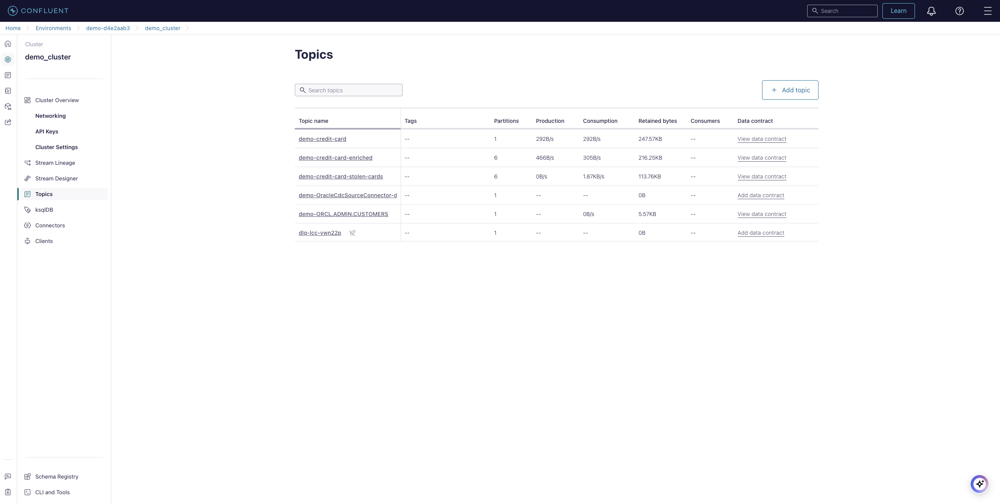

# Overview

This is a demo to try out Flink and Oracle CDC Source Connector on Confluent Cloud.

This demo uses Terraform to deploy the resources and create a data product and have it pushed to an Atlas MongoDB:
 - `demo-credit-card-stolen-cards`:
    - merge of a non-transactional table `demo-ORCL.ADMIN.CUSTOMERS` (CDC'ed from an Oracle Database) with a transactional one `demo-credit-card`
    - list all cases where the sum of all transactions within a given timeframe is greater than the average credit card transaction for a given user


# Pre-requisites
- User account on [Confluent Cloud](https://www.confluent.io/confluent-cloud/tryfree)
- User account on [AWS](https://docs.aws.amazon.com/cli/latest/userguide/getting-started-install.html)
- User account on [Atlas MongoDB](https://account.mongodb.com/account/login)
- Local install of [Terraform](https://www.terraform.io)
- Local install of [jq](https://jqlang.github.io/jq/download)

# Installation (only need to do that once)

## Install Terraform
```shell
brew tap hashicorp/tap
brew install hashicorp/tap/terraform
brew update
brew upgrade hashicorp/tap/terraform
```

## Install jq
```shell
brew install jq
```

# Provision services for the demo

## Set environment variables
- Create file `.env` (see example below)

```shell
#!/bin/bash

# Confluent Platform
export CONFLUENT_CLOUD_API_KEY="Enter credentials here"
export CONFLUENT_CLOUD_API_SECRET="Enter credentials here"

#MongoDB Atlas
export MONGODB_ATLAS_PUBLIC_KEY="Enter credentials here"
export MONGODB_ATLAS_PRIVATE_KEY="Enter credentials here"
export MONGODB_ATLAS_PROJECT_ID="Enter MongoDB Atlas Project ID here"
export MONGODB_ATLAS_PUBLIC_IP_ADDRESS="Enter the CIDR range(s) allowed to access MongoDB (including your own public WAN IP CIDR), or allow all, for example: 0.0.0.0/0"
#export MONGODB_ATLAS_PUBLIC_IP_ADDRESS=`curl -s http://ifconfig.me`"/32"

echo "WAN IP Address: $MONGODB_ATLAS_PUBLIC_IP_ADDRESS"
```

## Starting the Demo
- Run command: `./demo_start.sh`
- That will deploy the following resources:
  - Confluent Cloud [Environment](https://docs.confluent.io/cloud/current/security/access-control/hierarchy/cloud-environments.html) and [Schema Registry](https://docs.confluent.io/cloud/current/sr/schema_registry_ccloud_tutorial.html)
  - Confluent Cloud [Apache Kafka Cluster](https://docs.confluent.io/cloud/current/clusters/create-cluster.html)
  - Confluent Cloud Service Accounts, Role Bindings, Credentials / API Keys


  - Confluent Cloud [Flink Compute Pool](https://docs.confluent.io/cloud/current/flink/concepts/compute-pools.html)


  - Oracle Database (RDS)
  - The table `ORCL.ADMIN.CUSTOMERS` will be created on the Oracle DB. You can use your prefered RDBMS to viasualise the table (credentials set on `vars.tf`, see variables `rds_username` and `rds_password`). See screenshot below using [DBeaver Community Edition](https://dbeaver.io/download/)


- Create Kafka topics for the DataGen Connector (Credit Card transactions)
  - Confluent Cloud [DataGen Connector](https://docs.confluent.io/cloud/current/connectors/cc-datagen-source.html) publish to topic `demo-credit-card`
  - Confluent Cloud [Oracle CDC connector](https://docs.confluent.io/cloud/current/connectors/cc-oracle-cdc-source/cc-oracle-cdc-source.html) publish to topic `demo-ORCL.ADMIN.CUSTOMERS`


## Flink Compute Pool (SQL Statements)
 - Access Confluent Cloud WebUI: https://confluent.cloud/login
 - Access your Environment: `demo-XXXXXXXX`
 - Select tab `Flink (preview)`
 - Access your Flink Compute Pool: `standard_compute_pool-XXXXXXXX`
 - Click `Open SQL workspace`
 - Make sure to select:
   - Catalog: `demo-XXXXXXXX`
   - Database: `demo_cluster`
 - Submit the following SQL queries (one at a time):

```SQL
-------------------------------------------------------------------------
-- Create Table `demo-customers` derived from `demo-ORCL.ADMIN.CUSTOMERS`
-------------------------------------------------------------------------
CREATE TABLE `demo-customers` (
  `user_id` BIGINT,
  `first_name` STRING,
  `last_name` STRING,
  `email` STRING,
  `avg_credit_spend` DOUBLE,
  PRIMARY KEY (`user_id`) NOT ENFORCED  -- IMPORTANT AS THIS IS A GLOBAL TABLE!
);

INSERT INTO `demo-customers`
  SELECT
    CAST(ID AS BIGINT) AS `user_id`,
    FIRST_NAME AS `first_name`,
    LAST_NAME AS `last_name`,
    EMAIL AS `email`,
    AVG_CREDIT_SPEND AS `avg_credit_spend`
  FROM `demo-ORCL.ADMIN.CUSTOMERS`;

----------------------------------------------------------
-- View demo-credit-card table (from topic with same name)
----------------------------------------------------------
describe extended `demo-credit-card`;

select * from `demo-credit-card`;

--------------------------------------------------------------------------------------------------
-- Merge tables demo-credit-card (transactional) and demo-ORCL.ADMIN.CUSTOMERS (non-transactional) 
--------------------------------------------------------------------------------------------------
CREATE TABLE `demo-credit-card-enriched` (
  `user_id` BIGINT,
  `credit_card_number` STRING,
  `amount` DOUBLE,
  `transaction_timestamp` TIMESTAMP(3),
  `first_name` STRING,
  `last_name` STRING,
  `email` STRING,
  `avg_credit_spend` DOUBLE,
  WATERMARK FOR `transaction_timestamp` AS `transaction_timestamp` - INTERVAL '1' MINUTES
) WITH (
  'changelog.mode' = 'retract'  -- IMPORTANT BECAUSE OF THE PRIMARY KEY ON `demo-customers`!
);

INSERT INTO `demo-credit-card-enriched`
  SELECT
    T.user_id,
    T.credit_card_number,
    T.amount,
    CAST(T.transaction_timestamp AS TIMESTAMP) AS transaction_timestamp,
    C.first_name,
    C.last_name,
    C.email,
    C.avg_credit_spend
  FROM `demo-credit-card` T
  INNER JOIN `demo-customers` C
  ON T.user_id = C.user_id;

----------------------------------------------------------------------------------
-- Create table demo-credit-card-stolen-cards (topic with same name to be created)
----------------------------------------------------------------------------------
CREATE TABLE `demo-credit-card-stolen-cards` (
  `window_start` TIMESTAMP(3),
  `window_end` TIMESTAMP(3),
  `user_id` BIGINT,
  `credit_card_number` STRING,
  `first_name` STRING,
  `last_name` STRING,
  `email` STRING,
  `transaction_timestamp` TIMESTAMP(3),
  `total_credit_spend` DOUBLE,
  `avg_credit_spend` DOUBLE
);

INSERT INTO `demo-credit-card-stolen-cards`
  SELECT
    window_start,
    window_end,
    user_id,
    credit_card_number,
    first_name,
    last_name,
    email,
    transaction_timestamp,
    SUM(amount) AS total_credit_spend,
    MAX(avg_credit_spend) as avg_credit_spend
  FROM TABLE (
    TUMBLE(TABLE `demo-credit-card-enriched`, DESCRIPTOR(transaction_timestamp), INTERVAL '30' SECOND )
  )
  GROUP BY window_start, window_end, user_id, credit_card_number, first_name, last_name, email, transaction_timestamp
  HAVING SUM(amount) > MAX(avg_credit_spend);


--------------------------------------------------------------------------------------------
-- Alternativelly you can create an STATEMENT SET combining all INSERTS statements into one
-- That might help improving performance and reducing costs
--------------------------------------------------------------------------------------------
EXECUTE STATEMENT SET
BEGIN
--
INSERT INTO `demo-customers` SELECT ...
--
INSERT INTO `demo-credit-card-enriched` SELECT ...
--
INSERT INTO `demo-credit-card-stolen-cards` SELECT ...
END;
```

### Running Flink SQL statements
To view all running Flink SQL statements:
 - Access your Environment: `demo-XXXXXXXX`
 - Select tab `Flink (preview)`
 - Select tab `Flink statements`
 - Filter by Status `Running` (see example below)




## Add MongoDB + Sink Connector
- Run command: `./demo_mongo.sh`
- That will deploy the following resources:
  - Mongo Atlas free tier cluster
  - Mongo Atlas Whitelist IP Address and Create DB user
  - Confluent Cloud [MongoDB Sink Connector](https://docs.confluent.io/cloud/current/connectors/cc-mongo-db-sink/cc-mongo-db-sink.html)
- To visualise the data product in MongoDB, a new collection named `demo-credit-card-stolen-cards` will be created.


### Confluent Cloud Stream Lineage
The [Confluent Stream Lineage](https://developer.confluent.io/courses/governing-data-streams/stream-lineage/) is a tool that allows us to see, at a glance, how our data streams fit together to form larger pipelines. It combines details from our producers, consumers, and topics to give an overall picture of the system. It also integrates with various metrics to allow us to dive deeper into any individual component. In this video, we'll introduce you to the Stream Lineage.


### Confluent Cloud Data Portal
The [Confluent Data Portal](https://docs.confluent.io/cloud/current/stream-governance/data-portal.html) is a self-service interface for discovering, exploring, and accessing Apache Kafka® topics on Confluent Cloud.

Building new streaming applications and pipelines on top of Kafka can be slow and inefficient when there is a lack of visibility into what data exists, where it comes from, and who can grant access. Data Portal leverages [Stream Catalog](https://docs.confluent.io/cloud/current/stream-governance/data-portal.html) and [Stream Lineage](https://docs.confluent.io/cloud/current/stream-governance/stream-lineage.html#cloud-stream-lineage) to empower data users to interact with their organization’s data streams efficiently and collaboratively.

With Data Portal, data practitioners can:
 - **Search and discover existing topics** with the help of topic metadata and get a drill-down view to understand data they hold (without access to the actual data).
 - **Request access to topics** through an approval workflow that connects the data user with the data owner, and admins that can approve the request.
 - **View and use data in topics** (once access is granted) to build new streaming applications and pipelines.


## Stoping the Demo
- Run command: `./demo_stop.sh`
- All resources will be destroyed, no need to stop the SQL statements on the Flink compute pool

# Terraform files
- `vars.tf`:
  - Main system variables (change it as needed)
- `providers.tf`:
  - hashicorp/aws
  - confluentinc/confluent
  - mongodb/mongodbatlas
  - hashicorp/external (To read env variables)
- `aws_rds.tf`: 
  - Oracle Database (RDS)
- `cflt_cloud.tf`: 
  - Confluent Cloud Environment
  - Schema Registry
  - Apache Kafka Cluster
  - Flink Compute Pool
  - Service Accounts (sr, clients)
  - Role Bindings (sr, clients)
  - Credentials / API Keys (sr, clients)
- `cflt_connectors.tf`:
  - Service Accounts (Connectors)
  - Access Control List
  - Credentials / API Keys
  - Create Kafka topics for the DataGen Connector (Credit Card transactions)
  - DataGen Connector
  - Oracle CDC connector
- `mongodb.tf`:
  - Create free tier cluster (only one allowed per Atlas account)
  - Whitelist IP Address
  - Create DB user
  - MongoDB Sink Connector


# External References
Check out [Confluent's Developer portal](https://developer.confluent.io), it has free courses, documents, articles, blogs, podcasts and so many more content to get you up and running with a fully managed Apache Kafka service.

Disclaimer: I work for Confluent :wink: